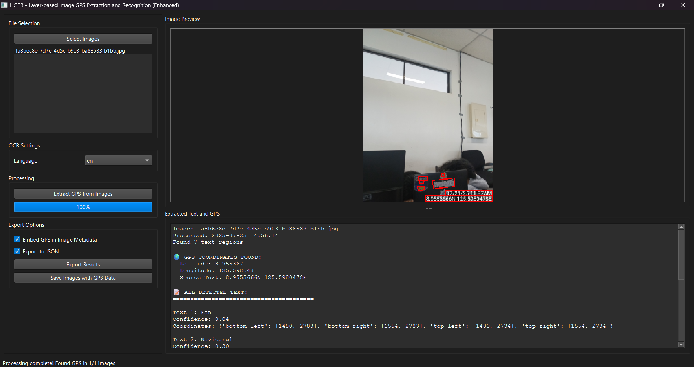

# LIGER - Layer-based Image GPS Extraction and Recovery

[](https://www.python.org/downloads/)
[](LICENSE)
[](https://pypi.org/project/PyQt6/)

**LIGER** is an advanced OCR-based application that extracts GPS coordinates from images containing text and embeds them directly into image metadata. Perfect for geotagging photos, processing screenshots of maps, or extracting location data from any image containing coordinate information.



## 🌟 Key Features

### 📍 Enhanced GPS Extraction with Advanced Pattern Recognition
- **Multiple GPS Format Support**: Recognizes various coordinate formats including:
  - Decimal Degrees: `40.7128, -74.0060`
  - Degrees Minutes Seconds: `40°42'46"N, 74°00'21"W`
  - Degrees Decimal Minutes: `40°42.767'N, 74°00.350'W`
  - Labeled Coordinates: `LAT: 40.7128, LON: -74.0060`
  - GPS Tags: `GPS: (40.7128, -74.0060)`
  - Comma-separated DMS: `N 9° 38' 42.861", E 125° 32' 58.411"`
- **Enhanced Degree Symbol Recognition**: Supports multiple degree representations (`°`, `º`, `˚`, `o`, `0`, `deg`)
- **Priority-based Pattern Matching**: Higher confidence for explicitly labeled GPS coordinates
- **Advanced False Positive Filtering**: Intelligent exclusion of timestamps, file sizes, camera settings, and other non-GPS data

### 🔍 Advanced OCR Processing with Multi-Pass Technology
- **EasyOCR Integration**: High-accuracy text recognition with model caching
- **Multi-language Support**: English, Chinese, French, German, Korean, Japanese
- **Multi-Pass OCR Processing**: Three-pass system with varying confidence thresholds
- **Smart Region Detection (ROI)**: Targeted processing of coordinate-likely regions
- **GPU Acceleration Support**: Optional GPU processing for faster performance
- **Visual Text Overlay**: See exactly where text was detected with bounding boxes
- **Overlap Detection**: Intelligent merging of duplicate text detections

### 💾 Comprehensive Metadata Embedding
- **Standard EXIF GPS Integration**: Embeds coordinates in industry-standard GPS EXIF fields
- **Cross-platform Compatibility**: GPS data readable by photo viewers, mapping apps, and photo management tools
- **Batch Processing**: Process multiple images simultaneously with progress tracking
- **Original File Preservation**: Option to create copies with GPS data or modify originals
- **Detailed Processing Metadata**: Complete audit trail including OCR confidence scores

### 📊 Enhanced Export and Processing Options
- **JSON Export**: Detailed extraction results with confidence scores and processing metadata
- **Image Copies with GPS**: Save new versions with embedded GPS metadata
- **Processing Reports**: Complete audit trail of extraction process
- **Model Cache Management**: Efficient caching and clearing of OCR models
- **Confidence Level Reporting**: HIGH, MEDIUM-HIGH, MEDIUM, LOW confidence classifications

### 🎨 Modern User Interface
- **Custom Styling**: Modern, polished interface with custom color schemes
- **Enhanced Image Display**: Improved styling with rounded borders and better visual feedback
- **Real-time Progress Tracking**: Live updates during processing
- **Comprehensive Status Messages**: Detailed feedback on processing status and results

## 🚀 Installation

### Prerequisites
- Python 3.7 or higher
- pip package manager
- easyocr 1.6.0
- pillow v.8
- pyqt6 
- piexif v1.1.3

### Dependencies Installation

```bash
# Clone the repository
git clone https://github.com/dxlmartin00/OCR-App.git

```
### Additional Setup
EasyOCR will automatically download language models on first use. The application includes intelligent model caching to improve performance on subsequent runs.

## 📖 Usage

### Running the Application
- Launch the Set-up.bat and wait for the download to finish.
- Then Launch the LIGER.bat to open the app.

### Step-by-Step Guide

1. **Select Images**
   - Click "Select Images" to choose one or more image files
   - Supported formats: PNG, JPG, JPEG, BMP, TIFF, WebP

2. **Configure Advanced OCR Settings**
   - Choose the appropriate language for text recognition (default: English)
   - **Multi-pass OCR**: Enable for higher accuracy (recommended)
   - **Smart Region Detection**: Enable ROI processing for better coordinate detection
   - **GPU Acceleration**: Enable if you have a compatible GPU

3. **Process Images with Enhanced Algorithm**
   - Click "Extract GPS from Images" to start processing
   - Watch real-time progress with detailed status updates
   - Advanced three-pass OCR system automatically processes each image
   - Smart region detection focuses on areas likely to contain coordinates

4. **Review Comprehensive Results**
   - Select images from the list to view:
     - Original image with precise text detection overlays
     - Extracted text with OCR confidence scores
     - GPS coordinates with extraction confidence levels
     - Detailed processing metadata and timestamps

5. **Export with Multiple Options**
   - **Embed GPS in Original Files**: Adds GPS metadata to your original images
   - **Save Images with GPS Data**: Creates copies with embedded GPS information
   - **Export to JSON**: Detailed extraction results with full processing information

6. **Model Cache Management**
   - View cached OCR models for different languages
   - Clear cache when needed to free up disk space

## 🔧 Technical Details

### Enhanced GPS Coordinate Detection Algorithm

The application uses a sophisticated multi-layer recognition system:

1. **Priority-based Pattern Matching**: 10-level priority system with labeled GPS coordinates receiving highest priority
2. **Advanced Validation Layer**: 
   - Coordinate range validation (-90 to 90 for latitude, -180 to 180 for longitude)
   - Context-aware precision requirements
   - Geographic reasonableness checks
3. **Comprehensive False Positive Filtering**: Excludes over 100 different patterns including:
   - Timestamps and dates
   - File sizes and data rates
   - Camera settings (ISO, aperture, shutter speed)
   - Measurements and technical specifications
   - Serial numbers and model information
4. **Context Scoring**: GPS context awareness based on surrounding text
5. **Confidence Classification**: Four-level confidence system (HIGH, MEDIUM-HIGH, MEDIUM, LOW)

### Multi-Pass OCR Processing System

1. **Pass 1**: High confidence detection (text_threshold=0.8, min_size=10)
2. **Pass 2**: Medium confidence for missed text (text_threshold=0.6, min_size=5)
3. **Pass 3**: Low confidence for coordinate patterns (text_threshold=0.4, min_size=3)
4. **ROI Processing**: Targeted processing of 8 coordinate-likely regions
5. **Overlap Resolution**: Intelligent merging of duplicate detections

### Supported GPS Formats with Priority Levels

| Format | Example | Priority | Confidence |
|--------|---------|----------|------------|
| Labeled GPS | `GPS: 40.7128, -74.0060` | 10 | HIGH |
| Lat/Lon Labels | `LAT: 40.7128 N, LON: 74.0060 W` | 9 | HIGH |
| DMS with Direction | `40°42'46"N, 74°00'21"W` | 9 | MEDIUM-HIGH |
| DMS Comma Format | `N 9° 38' 42.861", E 125° 32' 58.411"` | 9 | MEDIUM-HIGH |
| Decimal with Direction | `N40.7128, W74.0060` | 7 | MEDIUM |
| Pure Decimal | `40.712800, -74.006000` | 5 | LOW |

### EXIF Metadata Structure

GPS coordinates are embedded using standard EXIF GPS tags:
- `GPSLatitude` & `GPSLatitudeRef` (degrees, minutes, seconds format)
- `GPSLongitude` & `GPSLongitudeRef` (degrees, minutes, seconds format)
- `GPSMapDatum` (WGS-84 standard)
- `GPSVersionID` (GPS specification version)

Additional comprehensive metadata includes:
- Processing timestamp and OCR engine information
- Source text that contained GPS coordinates
- OCR confidence scores and processing statistics
- Original filename and processing parameters

## 📁 Project Structure

```
liger-gps-extractor/
├── main.py                # Main application with enhanced UI
├── gps_extractor.py       # Advanced GPS extraction engine
├── ocr_worker.py          # Multi-threaded OCR worker with caching
├── image_display.py       # Enhanced image display widget
├── app_icon.png           # App logo
├── app_logo.png           # 1:1 logo
├── README.md              # This documentation
├── gitignore              
├── screenshots/           # Application screenshots
│   ├── Screenshot_1.png
│   └── Screenshot_2.png

```

## 🔍 Example Use Cases

### 📱 Map Screenshots and Navigation
Extract GPS coordinates from:
- Google Maps screenshots with various coordinate formats
- GPS device displays and dashboards
- Navigation app screenshots
- Survey photos with embedded coordinates

### 📷 Field Documentation
Process images containing:
- GPS device readouts and displays
- Coordinate annotations and markings
- Survey markers and reference points
- Scientific field documentation

### 🗺️ Technical Document Processing
Extract coordinates from:
- Technical reports and surveys
- Research papers with coordinate data
- Field notes and documentation
- Geographic information systems exports

### 📊 Data Recovery and Migration
- Recover GPS data from screenshot archives
- Process historical coordinate documentation
- Convert coordinate formats between systems
- Validate and verify coordinate accuracy

## ⚡ Performance Tips and Optimization

1. **Image Quality**: Higher resolution images with clear, readable text yield better results
2. **Language Selection**: Choose the correct language model for optimal OCR accuracy
3. **GPU Acceleration**: Enable GPU processing if available for faster performance
4. **Batch Processing**: Process multiple images together for efficiency
5. **Model Caching**: First run downloads models; subsequent runs are much faster
6. **ROI Detection**: Smart region detection improves accuracy for coordinate-heavy images
7. **Format Compatibility**: Use JPEG or TIFF for best EXIF metadata support

## 🐛 Troubleshooting and Common Issues

### OCR and Processing Issues

**OCR Model Loading Failed**
- Ensure stable internet connection for initial model download
- Check available disk space (models require 100-500MB each)
- Verify Python version compatibility (3.7+)
- Try clearing model cache and redownloading

**No GPS Coordinates Detected**
- Verify image contains visible coordinate text
- Try different language models if text is in multiple languages
- Enable Multi-pass OCR for better detection
- Check if coordinates match supported formats
- Ensure text is clear and readable (minimum 10px text height recommended)

**Low Detection Accuracy**
- Enable Smart Region Detection (ROI)
- Use Multi-pass OCR processing
- Try GPU acceleration if available
- Increase image resolution if possible

### Metadata and Export Issues

**EXIF Embedding Failed**
- Some image formats don't support EXIF data (PNG, WebP)
- Use "Save Images with GPS Data" for automatic format conversion
- Check file permissions for original images
- Verify sufficient disk space for output files

**Export Errors**
- Ensure write permissions in output directory
- Check available disk space
- Verify all required dependencies are installed

### Performance Issues

**Slow Processing**
- Enable GPU acceleration if available
- Process smaller batches of images
- Clear model cache if memory is limited
- Close other resource-intensive applications

**Memory Issues**
- Process images in smaller batches
- Clear model cache between sessions
- Reduce image resolution if extremely high
- Ensure sufficient RAM (4GB+ recommended)

## 🤝 Contributing

We welcome contributions! Here's how to get started:

1. Fork the repository
2. Create a feature branch: `git checkout -b feature/new-feature`
3. Make your changes and test thoroughly
4. Commit your changes: `git commit -m 'Add new feature'`
5. Push to the branch: `git push origin feature/new-feature`
6. Submit a pull request

### Development Setup
```bash
# Clone your fork
git clone https://github.com/dxlmartin00/OCR-App.git
cd OCR-App

# Run the application
python main.py
```

### Development Guidelines
- Follow existing code style and patterns
- Add comprehensive comments for new algorithms
- Test with various coordinate formats and image types
- Update documentation for new features

## 📝 License

This project is licensed under the MIT License - see the [LICENSE](LICENSE) file for details.

## 🙏 Acknowledgments

- **EasyOCR**: Excellent OCR library by JaidedAI for text recognition
- **PyQt6**: Powerful GUI framework for cross-platform applications
- **piexif**: EXIF data manipulation library for metadata embedding
- **Pillow**: Python Imaging Library for image processing
- **Replit**: Development and deployment platform

## 📧 Support and Contact

- **Email**: lummartin@nemsu.edu.ph
- **Issues**: Create an issue on GitHub for bug reports or feature requests

## 🔄 Version History

### v2.1.0 (Current)
- **Executable File**: Added the Set-up.bat file for easy installment of dependencies

### v2.0.0 (Previous)
- **Enhanced GPS Extraction**: Advanced pattern recognition with priority-based matching
- **Multi-Pass OCR Processing**: Three-pass system with smart region detection
- **Improved UI**: Modern styling with enhanced visual feedback
- **Model Caching System**: Efficient OCR model management
- **Advanced False Positive Filtering**: Comprehensive exclusion patterns
- **GPU Acceleration Support**: Optional GPU processing for performance
- **Confidence Level Reporting**: Four-level confidence classification
- **ROI Detection**: Smart processing of coordinate-likely regions

### v1.0.0 (Initial Release)
- Initial release with basic GPS extraction
- Multi-format coordinate support
- EXIF metadata embedding
- Batch processing capabilities
- Basic false positive filtering

---

**Made with ❤️ for the geospatial community**

*Enhanced with advanced OCR technology and intelligent coordinate detection*